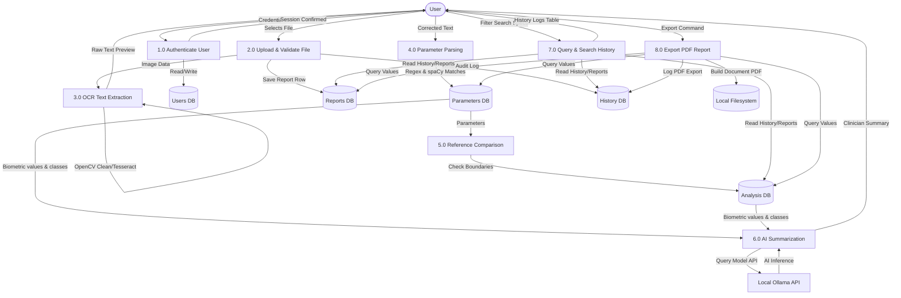

# Data Flow Diagram (DFD)

This document maps the flow of information through the application modules, databases, and users.

---

## 1. Level 0 DFD (Context Diagram)
The Context Diagram represents the application as a single process boundary and shows external entities (User, File System, Ollama Service):

```
                       ┌───────────────────────┐
                       │                       │
                       │                       │
                       │                       ▼
┌──────────────┐  Credentials & Documents  ┌──────────────────────────┐  Generated PDF Reports  ┌──────────────┐
│              ├──────────────────────────►│                          ├────────────────────────►│  Local File  │
│     USER     │                           │   AURA HEALTH SYSTEM     │                         │    SYSTEM    │
│              │◄──────────────────────────┤                          │◄────────────────────────┤              │
└──────────────┘    Biometric Analytics    └───────────┬──────────────┘    File Data Stream     └──────────────┘
                    & Health Trends                    │      ▲
                                                       │      │
                                            Prompt &   │      │ Summary
                                           Parameters  │      │ Response
                                                       ▼      │
                                                   ┌──────────┴───────┐
                                                   │   Local Ollama   │
                                                   │   (AI Engine)    │
                                                   └──────────────────┘
```

---

## 2. Level 1 DFD (Module Level Flows)
The Level 1 diagram breaks the system into distinct operational bubbles, data stores, and data movements:


