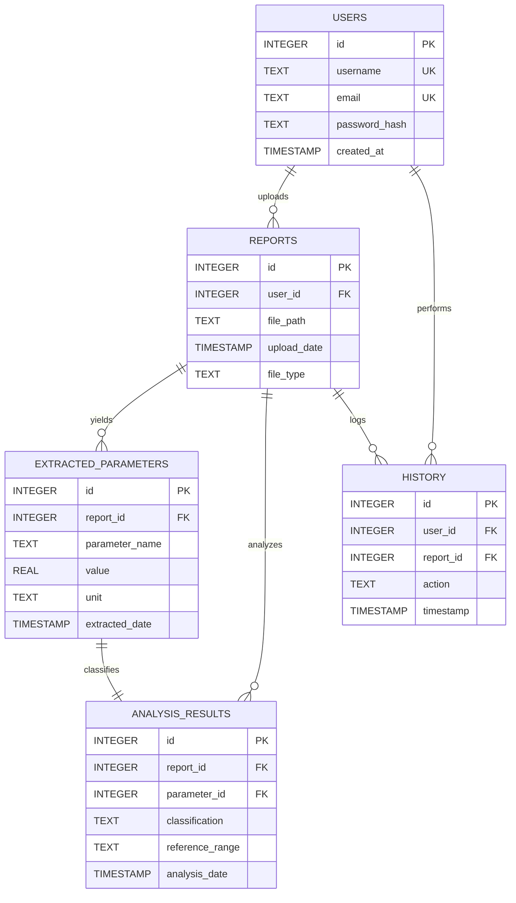

# Entity-Relationship (ER) Diagram

This document contains the Entity-Relationship Diagram for the database tables mapping data structures, keys, and relational cardinality.

## Mermaid ER Diagram

---

## Relationship Descriptions
1. **USERS to REPORTS (`1:N`)**: A single user can upload multiple medical reports. Removing a user deletes all associated report files cascadingly.
2. **USERS to HISTORY (`1:N`)**: A user generates multiple activity log rows (Login, Upload, Export, etc.).
3. **REPORTS to EXTRACTED_PARAMETERS (`1:N`)**: A parsed lab report yields one or more specific biometric records (Hemoglobin, WBC, glucose, etc.).
4. **REPORTS to ANALYSIS_RESULTS (`1:N`)**: A report contains multiple diagnostic parameter status classifications.
5. **REPORTS to HISTORY (`1:N`)**: Report deletions cascade to delete associated action audits in the history table.
6. **EXTRACTED_PARAMETERS to ANALYSIS_RESULTS (`1:1`)**: Every extracted biometric parameter maps to exactly one clinical classification status record.
